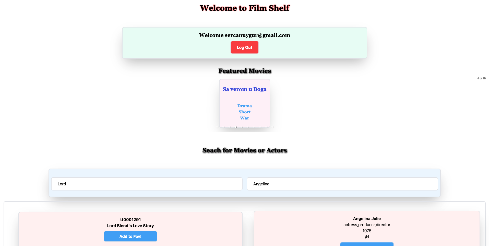

# FILM_SHELF_FRONTEND

This is a test project that uses [IMDB data](https://datasets.imdbws.com/) with the [React](https://tr.reactjs.org/), [Apollo Graphql](https://www.apollographql.com/) for frontend part. You can search with at least 4 characters (case-sensitive) and at least 3 character (case-sensitive) for movies and the casts respectively. You can also sign-up and add some movies, genres or the casts to your favorites. To do that you need to sign-in otherwise all you can do is just searching. The project uses [MongoDB](https://www.mongodb.com/) database and you can reach the Backend API from [here](https://github.com/eypsrcnuygr/film_shelf). For the styles I used [Tailwind](https://tailwindcss.com/).

<br>

## Built With

- Javascript
- React
- GraphQL
- React Apollo
- Tailwind
- Yarn

## Prerequisities

To get this project up and running locally, you must have node installed on your local machine.

## Live Link

## Getting Started

**Setup**

- Clone this repository with ```git clone git@github.com:eypsrcnuygr/FILM_SHELF_FRONTEND.git``` using your terminal or command line.<br>
- Change to the project directory by entering ```cd FILM_SHELF_FRONTEND``` in the terminal<br>
- Next run ```yarn``` to install the necessary dependencies<br>
- Run ```yarn start``` to have the necessary changes applied if you want to change anything in the codebase.<br>
- The command above will run the local server.<br>
- Wait for bundle to finish.<br>
- It uses [this](https://github.com/eypsrcnuygr/film_shelf) repo as API. To run your backend server please refer the given link.
- Enjoy!<br>

**Repository Content**

- All the content is inside the src folder. There you'll find components, constants, containers, helpers and the default files comes with create-react-app.
- The components folder contains represantational components.
- The containers folder contains statefull components (since I'm using hooks still functional components.), and making the GraphQL queries to the backend.
- The constants folder is the GraphQL schemas for the queries and the mutations.
- The helpers folder contains the writing and the pulling logic of the SessionKey to the LocalStorage.
- The App component is responsibele from forking in two client-side route and rendering related components.
- Inside the index.js I've arranged the Apoolo client configurations and it attaches the App to the DOM:

## Authors

👤 **Eyüp Sercan UYGUR**

-   Github: [@eypsrcnuygr](https://github.com/eypsrcnuygr)
-   Twitter: [@eypsrcnuygr](https://twitter.com/eypsrcnuygr)
-   LinkedIn: [eypsrcnuygr](https://www.linkedin.com/in/eypsrcnuygr/)
-   Email: [Eyüp Sercan UYGUR](sercanuygur@gmail.com)

## 🤝 Further Words and Future Improvements

- I think a pagination and partial rendering could be nice. I'll work on it. It needs some database manipulation as well.
- I didn't crawl from IMDB for two reasons. First I wanted to try MongoDB.Secondly, web scraping could be tedious, it can cause so many errors, or even the site could be blocked for this operation and for every search term couple of HTTP requests and the document parsing and sending this to the frontend as I said made me to think about database options plus IMDB API is limited and I've found the data I gave above. 
- I didn't do any frontend tests yet, hope in the future.
- The user page caches the results in the memory, any client side routing doesn't clear the cache. That was my intention however, if you do change some preferences in the main page for the user (adding some favorites) and return back, to see the applied changes you need to refresh the page. This is something should be thought and then implement the best procedure.

## 🤝 Contributing

Contributions, issues and feature requests are welcome!

## Show your support

Give a ⭐️ if you like this project!


## 📝 License

This project is [MIT](https://github.com/git/git-scm.com/blob/master/MIT-LICENSE.txt) licensed.
